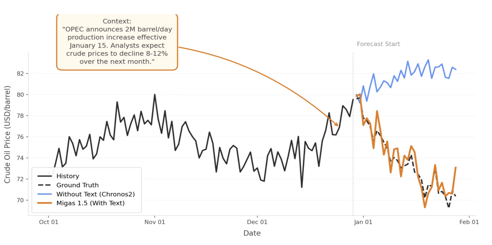

# Migas-1.5

[](https://huggingface.co/Synthefy/migas-1.5/tree/main) [](https://huggingface.co/datasets/Synthefy/fnspid) [](https://arxiv.org/abs/)

**Text-and-time-series fusion forecasting.** Migas-1.5 reads per-step text alongside historical values and fuses both into a single forecast. Rewrite the narrative — watch the forecast shift.



*When OPEC announces a surprise production cut, Migas-1.5 (orange) incorporates the news and forecasts a price rebound — while the text-free Chronos-2 baseline (blue) continues upward. Same numbers, different story.*

---

## Install

```bash
curl -LsSf https://astral.sh/uv/install.sh | sh   # install uv
uv sync
```

---

## Quick start

No LLM server needed. A 128-step crude-oil sample with a pre-written summary is bundled in the repo.

```python
import pandas as pd
from migaseval import MigasPipeline

# Load the bundled crude-oil context window
df = pd.read_csv("data/oil_scenario_sim.csv")
df.head()
#             t      y_t 
# 0  2024-08-27  71.870  
# 1  2024-08-28  71.610  
# 2  2024-08-29  72.120  
# ...

ctx_df = df[df["split"] == "context"]

# Load the pre-written summary (factual history + forward-looking signals).
# When you have per-step text, Migas generates this automatically — see below.
with open("data/oil_scenario_sim_summary.txt") as f:
    summary = f.read()

pipeline = MigasPipeline.from_pretrained("Synthefy/migas-1.5", device="cpu")

forecast = pipeline.predict_from_dataframe(
    ctx_df, pred_len=16, summaries=[summary],
)
# forecast — numpy array of shape (16,), values in $/barrel
print(forecast.round(2))
# [61.94 62.08 62.21 62.35 ...]
```

**Plot it:**

```python
import sys
sys.path.insert(0, ".")  # repo root
from scripts.plotting_utils import plot_forecast_single, apply_migas_style

apply_migas_style()

context      = ctx_df["y_t"].values
ground_truth = df[df["split"] == "ground_truth"]["y_t"].values

fig, ax = plot_forecast_single(
    context, ground_truth,
    {"Migas-1.5": forecast},
    context_len=len(context), pred_len=16,
    title="Crude oil — 128-step context, 16-step forecast",
    text_summary=summary,
)
ax.set_ylabel("Price ($/barrel)")
```

---

## Using your own data

`predict_from_dataframe` accepts any DataFrame with columns `t`, `y_t`, and `text`.

| You have | How to run |
|----------|-----------|
| Time series + pre-written summary | Pass `summaries=[...]` — no LLM server needed |
| Time series + per-step text (news, notes, …) | Migas generates the summary automatically — see [LLM server](#optional-llm-server) |

```python
# With per-step text — Migas calls the LLM to summarize automatically
forecast = pipeline.predict_from_dataframe(df, pred_len=16, seq_len=128)

# With a pre-computed summary — no LLM call
forecast = pipeline.predict_from_dataframe(
    df, pred_len=16, seq_len=128,
    summaries=["FACTUAL SUMMARY: ... PREDICTIVE SIGNALS: ..."],
)
```

---

## Notebooks

| Notebook | LLM needed? | Description |
|----------|-------------|-------------|
| [Inference Quick Start](notebooks/migas-1.5-inference-quickstart.ipynb) | No | Fetch live market data from Yahoo Finance, provide a pre-written summary, and run a forecast. Zero setup beyond `uv sync`. |
| [Bring Your Own Data](notebooks/migas-1.5-bring-your-own-data.ipynb) | Optional | End-to-end on any Yahoo Finance ticker: fetch data, write or auto-generate a summary, compare Chronos-2 vs Migas-1.5, and explore counterfactual scenarios. LLM only needed for auto-generating window-aligned summaries (Section 3). |
| [Counterfactual Scenarios](notebooks/migas-1.5-counterfactual-scenarios.ipynb) | Optional | Swap bullish/bearish predictive signals and watch the forecast shift. Hand-written scenarios run without an LLM. Best-of-N candidate selection requires a vLLM server. |
| [Batch Inference](notebooks/migas-1.5-batch-inference.ipynb) | Optional | Run Migas-1.5 on multiple time series in one `predict()` call and iterate over a directory of CSVs. Pre-computed summaries skip the LLM entirely. |
| [Backtest and Metrics](notebooks/migas-1.5-backtest-and-metrics.ipynb) | Optional | Rolling-window backtest comparing Migas-1.5 and Chronos-2 with MAE, MSE, MAPE, and directional accuracy. Offline mode uses pre-computed summaries. |

---

## Resources

| Resource | Link |
|----------|------|
| Model weights | [Synthefy/migas-1.5](https://huggingface.co/Synthefy/migas-1.5) |
| FNSPID (prepared) | [Synthefy/fnspid](https://huggingface.co/datasets/Synthefy/fnspid) |
| Migas-1.5 suite | [Synthefy/migas-1.5-suite](https://huggingface.co/datasets/Synthefy/migas-1.5-suite) |

---

## Optional: LLM server

When you pass per-step text without pre-computed summaries, Migas calls a local LLM to generate them. The easiest way to start a server is the bundled helper script:

```bash
bash start_vllm.sh
# Reads VLLM_MODEL (default: openai/gpt-oss-120b), VLLM_PORT (default: 8004),
# CUDA_VISIBLE_DEVICES, and VLLM_TENSOR_PARALLEL_SIZE from the environment.
# Exits with a helpful message if vLLM is not installed.
```

Install vLLM first if needed:

```bash
uv sync --extra vllm
```

Or start any OpenAI-compatible server manually:

```bash
uv run vllm serve openai/gpt-oss-120b --port 8004
```

Then set the environment variables (defaults shown):

```bash
export VLLM_BASE_URL=http://localhost:8004/v1
export VLLM_MODEL=openai/gpt-oss-120b
```

Now `predict_from_dataframe()` will call the server automatically — no `summaries=` argument needed.

---

## Evaluation

Full evaluation docs — CLI reference, baselines, output layout, post-eval scripts — are in [docs/evaluation.md](docs/evaluation.md).
